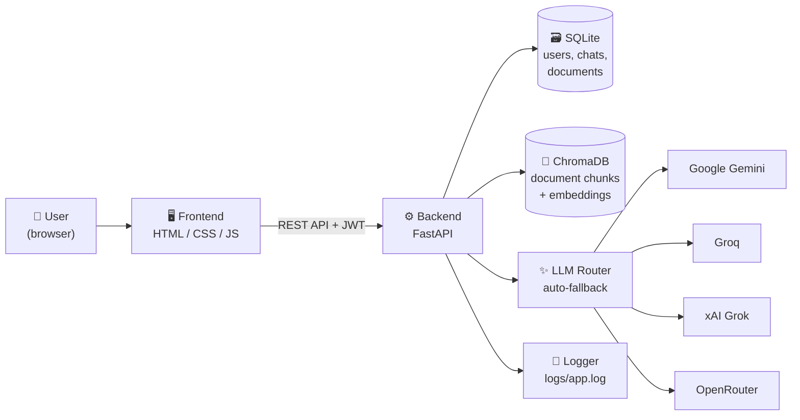
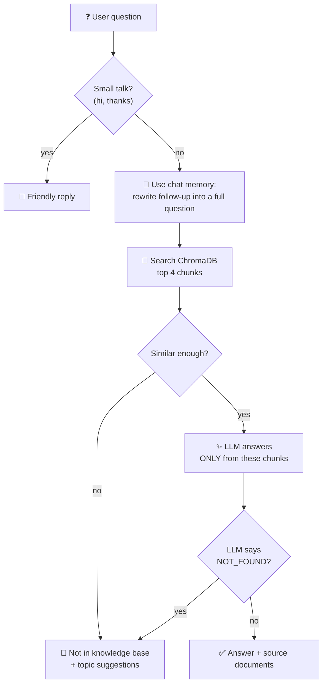

# 💬 KnowledgeDesk: AI Chatbot That Answers From Your Own Documents


**Name:** Rakib Hasan | **ID:** 1000129213 | **Course:** SICIP – Final Project 1

A chatbot that learns from **your documents** (PDF, Word, text, web pages) and answers **only** from them.
If the answer is not in the documents, it says so politely. It never guesses.

<p align="center"></p>

---

## ✅ Requirements Checklist

| Requirement | Status | How |
| --- | :---: | --- |
| Trainable on a custom knowledge base | ✅ | Upload files or URLs; they are split into chunks and stored in ChromaDB |
| Answers only from the knowledge base | ✅ | Strict prompt + only retrieved chunks are sent to the LLM |
| Graceful out-of-scope handling | ✅ | Similarity threshold + `NOT_FOUND` check → polite reply with topic suggestions |
| Intelligent knowledge retrieval (RAG) | ✅ | Semantic search over chunks, answer built from the best ones |
| Conversation memory | ✅ | Last 6 messages per chat; follow-up questions are rewritten |
| Multiple data formats | ✅ | PDF, DOCX, TXT, MD, HTML and web page URLs |
| Update knowledge without retraining | ✅ | Add, replace or delete documents live from the admin page |
| Authentication (users / admins) | ✅ | JWT login, hashed passwords, admin-only endpoints |
| API documentation | ✅ | Swagger at `/docs`, ReDoc at `/redoc`, and [docs/API.md](docs/API.md) |
| Backend logger | ✅ | Every request and event in `backend/logs/app.log` (also visible on the admin page) |
| Frontend chat app | ✅ | Login, chat with history, admin page |
| Clean API architecture | ✅ | The frontend talks to the backend only through REST API calls |
| **Multi-provider LLM fallback** | ✅ | **11 models across 4 providers — if one fails, the next one answers** |

---

## 🏗️ Architecture



### 🔄 Multi-Provider LLM Fallback

The system does **not** depend on a single AI provider. Instead, it tries up to **11 models across 4 providers** in order. If a model is busy, slow, or down, it automatically moves to the next one. Each model gets a 10-second timeout — the user never waits longer than necessary.

| Provider | Models | Cost |
| --- | --- | --- |
| Google Gemini | Gemini Flash Latest, Gemini 2.5 Flash Preview | Free tier |
| Groq | Llama 3.3 70B, Llama 3.1 8B, GPT-OSS 20B | Free tier (no credit card) |
| xAI Grok | Grok 3 Mini Fast | Free tier |
| OpenRouter | Gemma 4 27B, Gemma 4 31B, Nemotron Lightning, Nemotron Super, Qwen 3.8 27B | Free models (no credit card) |

You only need **one** API key to get started. The more keys you add, the more backup models you have.

---

## 🔍 How a Question Is Answered



There are **two safety checks** for out-of-scope questions: the similarity threshold, and the `NOT_FOUND` rule in the prompt.

---

## 📸 Screenshots

### Login

<p align="center"></p>

### Chat: answers with sources, memory and a polite fallback

<p align="center"></p>

👉 Every answer shows **which document** it came from. 👉 Out-of-scope questions get an amber **"Not in the knowledge base"** reply.

### New chat with example questions

<p align="center"></p>

### Admin: manage the knowledge base (no retraining)

<p align="center"></p>

### API documentation (Swagger)

<p align="center"></p>

---

## 📚 Sample Knowledge Base

The `knowledge_base/` folder has a sample help desk for a **fictional** university ("Riverbend University"). Because it is fictional, the bot can only know these facts from the documents, which proves it does not use outside knowledge.

| File | Format | Topic |
| --- | --- | --- |
| `about_riverbend_university.md` | Markdown | History, campus, departments, contact |
| `admissions_guide.txt` | Text | Requirements, test, deadlines |
| `tuition_fees_and_scholarships.pdf` | PDF | Fees, payment, scholarships |
| `library_rules.docx` | Word | Hours, borrowing, fines |
| `hostel_guide.txt` | Text | Rooms, rent, rules |
| `exam_and_grading_policy.md` | Markdown | Marks, grades, retakes |
| `cse_department.html` | HTML | CSE programs, labs, clubs |

**Try asking:**

| Question | Expected |
| --- | --- |
| What GPA do I need to apply? | ✅ Answer from `admissions_guide.txt` |
| How much is a single room in the hostel? → *and the meal plan?* | ✅ Memory: the follow-up works |
| What is the late fine for a library book? | ✅ Answer from `library_rules.docx` |
| Who won the football World Cup? | 🙏 Not in the knowledge base |

---

## 🚀 Quick Start

**You need:** Python 3.10 or newer, and at least **one** free API key from any of these providers:

| Provider | Get your free key at |
| --- | --- |
| Google Gemini | [ai.google.dev](https://ai.google.dev) |
| Groq | [console.groq.com](https://console.groq.com) (no credit card) |
| OpenRouter | [openrouter.ai](https://openrouter.ai) (no credit card) |
| xAI Grok | [console.x.ai](https://console.x.ai) |

```bash
# 1. Get the code
git clone https://github.com/rakib-506/ai-knowledge-chatbot.git
cd ai-knowledge-chatbot/backend

# 2. Create a virtual environment
python -m venv venv
venv\Scripts\activate          # Windows
# source venv/bin/activate     # Mac / Linux

# 3. Install packages
pip install -r requirements.txt

# 4. Settings: copy the example file, then add your API key(s) inside .env
copy .env.example .env         # Windows
# cp .env.example .env         # Mac / Linux

# 5. Start
uvicorn app.main:app --reload
```

Open **http://127.0.0.1:8000** for the chat app and **http://127.0.0.1:8000/docs** for the API docs.

Default admin login: `admin` / `admin123` (change it in `.env`).

> The first start downloads a small embedding model (about 80 MB) and loads the sample documents. This takes about 1 minute.

---

## 📁 Project Structure

```
ai-knowledge-chatbot/
├── backend/
│   ├── app/
│   │   ├── main.py             # FastAPI app, request logging, startup
│   │   ├── config.py           # settings from .env
│   │   ├── auth.py             # password hashing, JWT, admin check
│   │   ├── database.py         # SQLite: users, documents, chats, messages
│   │   ├── loaders.py          # PDF / DOCX / TXT / MD / HTML / URL → text
│   │   ├── knowledge_base.py   # chunking + ChromaDB (add, search, delete)
│   │   ├── chat.py             # RAG pipeline, memory, fallback
│   │   ├── llm.py              # Multi-provider LLM router with auto-fallback
│   │   ├── logger.py           # log file + console
│   │   ├── schemas.py          # request / response models
│   │   └── routers/            # auth.py, chat.py, knowledge.py (API endpoints)
│   ├── requirements.txt
│   └── .env.example
├── frontend/
│   ├── index.html              # login / register
│   ├── chat.html               # chat interface
│   ├── admin.html              # knowledge base manager
│   ├── css/style.css
│   └── js/                     # api.js, login.js, chat.js, admin.js
├── knowledge_base/             # starter documents (loaded on first start)
├── docs/API.md                 # API documentation
└── screenshots/
```

---

## 🧰 Tech Stack

| Part | Tool | Why |
| --- | --- | --- |
| Backend | FastAPI | Fast, simple, automatic API docs |
| Vector database | ChromaDB | Stores chunks and finds similar ones |
| Embeddings | all-MiniLM-L6-v2 (local) | Free, no API calls, runs on CPU |
| Answer writer | Multi-provider LLM fallback (Gemini, Groq, Grok, OpenRouter) | 11 models across 4 providers — always available |
| Database | SQLite | No setup needed |
| Auth | JWT + PBKDF2 password hashing | Standard and safe |
| Frontend | HTML, CSS, JavaScript | No build step, easy to read |

---

## ⚙️ Settings (`backend/.env`)

| Setting | Default | Meaning |
| --- | --- | --- |
| `GEMINI_API_KEY` | – | Google Gemini key (optional, from [ai.google.dev](https://ai.google.dev)) |
| `GROQ_API_KEY` | – | Groq key (optional, free at [console.groq.com](https://console.groq.com)) |
| `OPENROUTER_API_KEY` | – | OpenRouter key (optional, free at [openrouter.ai](https://openrouter.ai)) |
| `GROK_API_KEY` | – | xAI Grok key (optional, from [console.x.ai](https://console.x.ai)) |
| `CHUNK_WORDS` / `CHUNK_OVERLAP` | 180 / 40 | Chunk size and overlap (words) |
| `TOP_K` | 4 | How many chunks to search |
| `MIN_SIMILARITY` | 0.25 | Lower = answers more, higher = stricter |
| `MEMORY_MESSAGES` | 6 | How many past messages the bot remembers |

> **Tip:** You need at least one API key. The more you add, the more backup models you get. All providers above offer free tiers.

---

## 🚧 Limitations and Future Work

- Free-tier LLM APIs have rate limits (a few requests per minute per provider). The multi-provider fallback helps by spreading load across providers.
- Memory is short-term (within one chat), not across chats.
- Future work: streaming answers, chat export, Docker setup, and evaluation with a test question set.
