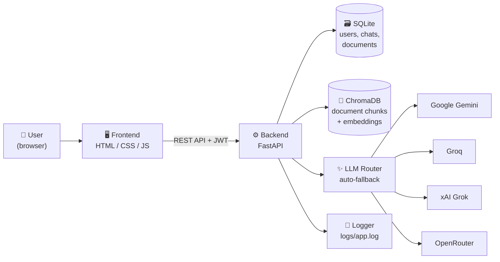
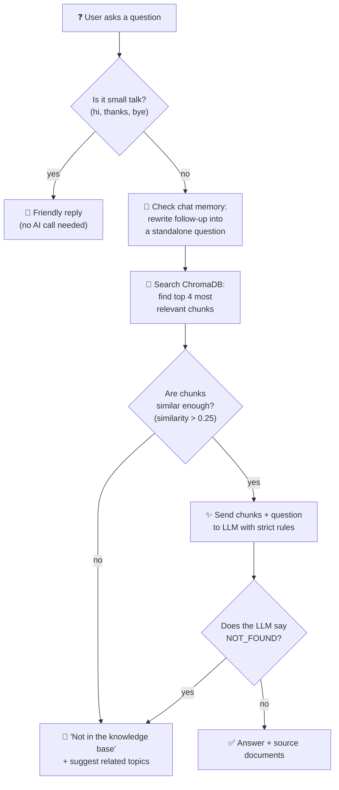

# 💬 KnowledgeDesk — AI Chatbot That Answers From Your Own Documents


> **Built by:** Rakib Hasan · **Student ID:** 1000129213 · **Course:** SICIP – Final Project 1

**KnowledgeDesk** is a full-stack **Retrieval-Augmented Generation (RAG)** chatbot that learns from your documents and answers **only** from them. Upload PDFs, Word files, text files, or even web page URLs — the chatbot reads them, understands them, and answers user questions using only the information inside those documents. If the answer isn't in the documents, it says so honestly. It never makes things up.

### 🌐 [Live Demo](https://ai-knowledge-chatbot.onrender.com) · 📘 [API Docs](https://ai-knowledge-chatbot.onrender.com/docs)

<p align="center"></p>

---

## 📌 Table of Contents

- [Why This Project?](#-why-this-project)
- [Features](#-features)
- [System Architecture](#-system-architecture)
- [How RAG Works (Step by Step)](#-how-rag-works-step-by-step)
- [User Roles: Admin vs Regular User](#-user-roles-admin-vs-regular-user)
- [Multi-Provider LLM Fallback](#-multi-provider-llm-fallback)
- [Screenshots](#-screenshots)
- [Sample Knowledge Base](#-sample-knowledge-base)
- [Quick Start (Run Locally)](#-quick-start-run-locally)
- [API Documentation](#-api-documentation)
- [Backend Logging](#-backend-logging)
- [Project Structure](#-project-structure)
- [Tech Stack](#-tech-stack)
- [Configuration](#-configuration)
- [Requirements Checklist](#-requirements-checklist)
- [Limitations and Future Work](#-limitations-and-future-work)

---

## 💡 Why This Project?

Most AI chatbots (like ChatGPT) answer from general internet knowledge. That's great for general questions, but **dangerous for organizations** — they can hallucinate facts, mix up policies, or give outdated information.

**KnowledgeDesk solves this** by restricting the AI to answer **only from documents you provide**. This makes it ideal for:

- 🏫 **University help desks** — answer student questions about admissions, fees, rules
- 🏢 **Company internal tools** — employees ask about HR policies, IT procedures
- 🏥 **Customer support** — answer FAQs from your product documentation
- 📚 **Research assistants** — query across multiple papers and reports

The AI doesn't guess. If the answer isn't in your documents, it tells the user honestly and suggests what topics it *can* help with.

---

## ✨ Features

### For Regular Users
| Feature | Description |
| --- | --- |
| 💬 **Chat with your documents** | Ask questions in plain language and get accurate answers sourced from uploaded documents |
| 📎 **Source attribution** | Every answer shows **which document** it came from, so users can verify the information |
| 🧠 **Conversation memory** | The bot remembers the last 6 messages in each chat, so follow-up questions like *"and the fees?"* work naturally |
| 🔄 **Follow-up rewriting** | Vague follow-ups like *"what about that?"* are automatically rewritten into full questions using chat context |
| 🙏 **Honest "I don't know"** | If the answer isn't in the documents, the bot says so politely and suggests related topics it *can* help with |
| 📝 **Chat history** | All conversations are saved — users can continue old chats or start new ones |
| 👋 **Small talk handling** | Greetings like "hi" or "thanks" get friendly replies without wasting an AI call |

### For Admins
| Feature | Description |
| --- | --- |
| 📤 **Upload documents** | Add PDF, DOCX, TXT, Markdown, HTML files, or paste a web page URL — the system reads and indexes them automatically |
| 🗑️ **Delete documents** | Remove any document from the knowledge base — the chatbot forgets it instantly |
| 🔄 **Live updates** | Add or remove documents without restarting the server or "retraining" anything |
| 📊 **View logs** | See backend activity logs directly from the admin page — who asked what, which model answered, any errors |
| 👥 **User management** | Admin-only endpoints are protected — regular users cannot access the admin panel |

### System-Level
| Feature | Description |
| --- | --- |
| 🔐 **Authentication** | JWT-based login with hashed passwords (PBKDF2) — no passwords stored in plain text |
| 🔄 **Multi-provider AI fallback** | 11 AI models across 4 providers — if one is down, the next one answers automatically |
| ⚡ **10-second timeout per model** | No model can hold up the system — slow models are skipped instantly |
| 📝 **Full backend logging** | Every request, every AI call, every error is logged with timestamps |
| 📖 **Auto-generated API docs** | Interactive Swagger UI and ReDoc available at `/docs` and `/redoc` |
| 🌐 **REST API architecture** | The frontend and backend communicate entirely through clean REST APIs |

---

## 🏗️ System Architecture

The application follows a clean **3-tier architecture**: a static frontend communicates with a FastAPI backend through REST APIs, and the backend coordinates between a SQL database, a vector database, and multiple AI providers.



**How the pieces fit together:**

- **Frontend** — Plain HTML, CSS, and JavaScript. No build tools needed. Talks to the backend only through `fetch()` API calls with JWT tokens for authentication.
- **FastAPI Backend** — Handles all business logic: user auth, document processing, RAG pipeline, and chat management.
- **SQLite** — Stores users, chat sessions, message history, and document metadata. Zero configuration needed.
- **ChromaDB** — A vector database that stores document chunks as numerical embeddings. When a user asks a question, ChromaDB finds the most relevant chunks by measuring semantic similarity.
- **LLM Router** — A custom multi-provider wrapper that tries AI models one by one until one responds. This means the chatbot stays online even when individual AI providers have downtime.
- **Logger** — Records every request, AI call, and error with timestamps. Visible both in the log file and through the admin panel.

---

## 🔍 How RAG Works (Step by Step)

**RAG (Retrieval-Augmented Generation)** is the core technique that makes this chatbot reliable. Instead of asking the AI to answer from memory (which leads to hallucination), we first **retrieve** relevant document chunks, then ask the AI to **generate** an answer using only those chunks.



**The two safety nets against hallucination:**

1. **Similarity threshold** (first check) — Before the AI even sees the question, ChromaDB checks if any document chunk is similar enough. If nothing matches, the user gets a polite "not in the knowledge base" response immediately.

2. **NOT_FOUND rule** (second check) — Even when chunks are found, the AI is instructed: *"If the answer is not in the provided context, reply with NOT_FOUND."* This catches cases where chunks are related but don't actually contain the answer.

---

## 👥 User Roles: Admin vs Regular User

The system has two roles, controlled by JWT authentication:

### 🧑‍💼 Admin
- **Log in** with the admin credentials (set in `.env`)
- **Upload documents** — PDF, DOCX, TXT, MD, HTML files or web URLs
- **Delete documents** — Remove any document; the knowledge base updates instantly
- **View all documents** — See what's in the knowledge base with file sizes and types
- **View backend logs** — Monitor system activity, errors, and AI model usage
- **Chat** — Admins can also use the chat like a regular user

### 👤 Regular User
- **Register** an account and **log in**
- **Ask questions** and get answers from the knowledge base
- **View chat history** — Continue old conversations or start new ones
- **Cannot** upload, delete, or manage documents
- **Cannot** access the admin panel or view logs

All admin-only API endpoints check the JWT token for admin privileges and return `403 Forbidden` if a regular user tries to access them.

---

## 🔄 Multi-Provider LLM Fallback

Free AI APIs are unreliable — models get rate-limited, go offline, or move behind paywalls without notice. Instead of depending on a single provider, KnowledgeDesk uses a **smart fallback system** that tries up to **11 models across 4 providers**:

| Provider | Models | Cost | How to get a key |
| --- | --- | --- | --- |
| Google Gemini | Gemini Flash Latest, Gemini 2.5 Flash Preview | Free tier | [ai.google.dev](https://ai.google.dev) |
| Groq | Llama 3.3 70B, Llama 3.1 8B, GPT-OSS 20B | Free (no credit card) | [console.groq.com](https://console.groq.com) |
| xAI Grok | Grok 3 Mini Fast | Free tier | [console.x.ai](https://console.x.ai) |
| OpenRouter | Gemma 4 27B, Gemma 4 31B, Nemotron Lightning, Nemotron Super, Qwen 3.8 27B | Free (no credit card) | [openrouter.ai](https://openrouter.ai) |

**How it works:**
1. A user asks a question
2. The system tries Model 1 (Gemini Flash Latest)
3. If it responds within 10 seconds → answer delivered ✅
4. If it times out or errors → automatically try Model 2, then Model 3, and so on
5. Bad API keys are detected and that entire provider is skipped for the session
6. The user always gets an answer (unless every single model is down simultaneously)

You only need **one** API key to get started. The more keys you add, the more backup models you have.

---

## 📸 Screenshots

### Login & Registration
Users can register a new account or log in with existing credentials. Admins use the credentials set in `.env`.

<p align="center"></p>

### Chat Interface
Ask questions in natural language. Every answer shows **which document** it came from (source attribution). Out-of-scope questions get a polite amber-colored "Not in the knowledge base" reply with topic suggestions.

<p align="center"></p>

### New Chat with Suggested Questions
When starting a new chat, the interface shows example questions the user can click to get started.

<p align="center"></p>

### Admin Panel: Knowledge Base Management
Admins can upload new documents (PDF, DOCX, TXT, MD, HTML, or URLs), view all indexed documents, and delete any document — all without restarting the server.

<p align="center"></p>

### Interactive API Documentation (Swagger)
FastAPI automatically generates interactive API docs. Developers can test every endpoint directly from the browser.

<p align="center"></p>

---

## 📚 Sample Knowledge Base

The `knowledge_base/` folder includes a help desk for a **fictional** university ("Riverbend University"). Using a fictional university proves the chatbot doesn't use outside knowledge — every fact must come from these documents.

| File | Format | Topic |
| --- | --- | --- |
| `about_riverbend_university.md` | Markdown | History, campus, departments, contact |
| `admissions_guide.txt` | Text | Requirements, test scores, deadlines |
| `tuition_fees_and_scholarships.pdf` | PDF | Fees, payment plans, scholarships |
| `library_rules.docx` | Word | Hours, borrowing limits, fines |
| `hostel_guide.txt` | Text | Room types, rent, hostel rules |
| `exam_and_grading_policy.md` | Markdown | Marks distribution, grades, retake policy |
| `cse_department.html` | HTML | CSE programs, labs, clubs |

**Try asking these:**

| Question | What happens |
| --- | --- |
| What GPA do I need to apply? | ✅ Answers from `admissions_guide.txt` with the exact GPA requirement |
| How much is a single room in the hostel? → *and the meal plan?* | ✅ Conversation memory kicks in — the follow-up works without repeating "hostel" |
| What is the late fine for a library book? | ✅ Answers from `library_rules.docx` with the fine amount |
| Who won the football World Cup? | 🙏 Politely says "not in the knowledge base" and suggests available topics |

---

## 🚀 Quick Start (Run Locally)

### Prerequisites
- Python 3.10 or newer
- At least **one** free API key (see the [LLM Fallback section](#-multi-provider-llm-fallback) for links)

### Steps

```bash
# 1. Clone the repository
git clone https://github.com/rakib-506/ai-knowledge-chatbot.git
cd ai-knowledge-chatbot/backend

# 2. Create and activate a virtual environment
python -m venv venv
venv\Scripts\activate          # Windows
# source venv/bin/activate     # Mac / Linux

# 3. Install dependencies
pip install -r requirements.txt

# 4. Create your environment file
copy .env.example .env         # Windows
# cp .env.example .env         # Mac / Linux

# 5. Open .env and add at least one API key
#    (GEMINI_API_KEY, GROQ_API_KEY, or OPENROUTER_API_KEY)

# 6. Start the server
uvicorn app.main:app --reload
```

Open **http://127.0.0.1:8000** → chat app · **http://127.0.0.1:8000/docs** → API docs

Default admin login: `admin` / `admin123` (change these in `.env`).

> 📝 The first start downloads a small embedding model (~80 MB) and indexes the sample documents. This takes about 1 minute.

---

## 📖 API Documentation

FastAPI provides **two automatic, interactive API documentation interfaces** — no extra work needed:

| Interface | URL | Best for |
| --- | --- | --- |
| **Swagger UI** | `/docs` | Testing endpoints interactively — you can fill in parameters and click "Execute" to see live responses |
| **ReDoc** | `/redoc` | Reading the API documentation — cleaner layout, better for understanding the full API structure |

A hand-written API reference is also available at [`docs/API.md`](docs/API.md).

### Key API Endpoints

| Method | Endpoint | Auth | Description |
| --- | --- | --- | --- |
| `POST` | `/api/auth/register` | — | Register a new user account |
| `POST` | `/api/auth/login` | — | Log in and receive a JWT token |
| `POST` | `/api/chat/` | 🔑 User | Create a new chat session |
| `POST` | `/api/chat/{id}/message` | 🔑 User | Send a message and get an AI answer |
| `GET` | `/api/chat/` | 🔑 User | List all chat sessions for the logged-in user |
| `GET` | `/api/chat/{id}` | 🔑 User | Get all messages in a specific chat |
| `POST` | `/api/knowledge/upload` | 🔑 Admin | Upload a document to the knowledge base |
| `POST` | `/api/knowledge/add-url` | 🔑 Admin | Add a web page URL to the knowledge base |
| `DELETE` | `/api/knowledge/{id}` | 🔑 Admin | Delete a document from the knowledge base |
| `GET` | `/api/knowledge/` | 🔑 Admin | List all documents in the knowledge base |
| `GET` | `/api/knowledge/logs` | 🔑 Admin | View backend activity logs |

All authenticated endpoints require a `Bearer` token in the `Authorization` header.

---

## 📝 Backend Logging

The backend logs **every significant event** to both the console and a persistent log file (`backend/logs/app.log`). This is essential for debugging, monitoring AI model behavior, and understanding usage patterns.

**What gets logged:**

| Event | Example log entry |
| --- | --- |
| Server startup | `INFO: Application startup complete` |
| User login | `INFO: User 'rakib' logged in` |
| Question asked | `INFO: Chat message received from user 'rakib'` |
| AI model tried | `INFO: Trying: Gemini Flash Latest ...` |
| AI model succeeded | `INFO: Using model: Gemini Flash Latest (gemini-flash-latest)` |
| AI model failed | `WARNING: Groq Llama 3.3 70B failed: timeout` |
| All models failed | `ERROR: All models failed: Gemini: busy | Groq: timeout` |
| Document uploaded | `INFO: Document 'library_rules.docx' added (12 chunks)` |
| Document deleted | `INFO: Document 'old_file.txt' removed` |

Admins can view recent logs directly from the **admin panel** without SSH access to the server — useful for monitoring the deployed version on Render.

---

## 📁 Project Structure

```
ai-knowledge-chatbot/
├── backend/
│   ├── app/
│   │   ├── main.py             # FastAPI app, CORS, request logging, startup
│   │   ├── config.py           # Loads settings from .env
│   │   ├── auth.py             # Password hashing (PBKDF2), JWT tokens, admin check
│   │   ├── database.py         # SQLite tables: users, documents, chats, messages
│   │   ├── loaders.py          # File readers: PDF, DOCX, TXT, MD, HTML, URL → text
│   │   ├── knowledge_base.py   # Chunking + ChromaDB: add, search, delete documents
│   │   ├── chat.py             # RAG pipeline: memory → search → LLM → response
│   │   ├── llm.py              # Multi-provider LLM router with automatic fallback
│   │   ├── logger.py           # Dual logging: console + file
│   │   ├── schemas.py          # Pydantic request/response models
│   │   └── routers/
│   │       ├── auth.py         # /api/auth/* endpoints (register, login)
│   │       ├── chat.py         # /api/chat/* endpoints (create, message, history)
│   │       └── knowledge.py    # /api/knowledge/* endpoints (upload, delete, list)
│   ├── requirements.txt
│   ├── .env.example            # Template for environment variables
│   └── .gitignore
├── frontend/
│   ├── index.html              # Login and registration page
│   ├── chat.html               # Chat interface with history sidebar
│   ├── admin.html              # Admin panel: document management + logs
│   ├── css/style.css           # Responsive styles
│   └── js/
│       ├── api.js              # API client: all fetch() calls in one place
│       ├── login.js            # Login/register form logic
│       ├── chat.js             # Chat UI: messages, history, markdown rendering
│       └── admin.js            # Admin UI: upload, delete, log viewer
├── knowledge_base/             # Sample documents (loaded on first startup)
├── docs/API.md                 # Hand-written API reference
├── screenshots/                # README images
└── render.yaml                 # Render.com deployment configuration
```

---

## 🧰 Tech Stack

| Layer | Technology | Why this choice |
| --- | --- | --- |
| **Backend framework** | FastAPI | Async, fast, auto-generates OpenAPI docs, great for REST APIs |
| **Vector database** | ChromaDB | Purpose-built for embedding storage and similarity search; zero-config setup |
| **Embeddings** | all-MiniLM-L6-v2 (runs locally) | Free, no API calls needed, runs on CPU, good quality for semantic search |
| **LLM / Answer generation** | Multi-provider fallback (Gemini, Groq, Grok, OpenRouter) | 11 models across 4 providers — always available, all free tier |
| **SQL database** | SQLite | Zero configuration, file-based, perfect for single-server deployment |
| **Authentication** | JWT + PBKDF2 hashing | Industry standard; passwords are hashed, tokens expire after 8 hours |
| **Frontend** | HTML + CSS + JavaScript (vanilla) | No build step, no node_modules, easy to understand and modify |
| **Deployment** | Render.com | Free tier, auto-deploys from GitHub, supports Python |

---

## ⚙️ Configuration

All settings are in `backend/.env` (copy from `.env.example`):

### API Keys (at least one required)

| Variable | Description |
| --- | --- |
| `GEMINI_API_KEY` | Google Gemini key — free at [ai.google.dev](https://ai.google.dev) |
| `GROQ_API_KEY` | Groq key — free, no credit card, at [console.groq.com](https://console.groq.com) |
| `OPENROUTER_API_KEY` | OpenRouter key — free, no credit card, at [openrouter.ai](https://openrouter.ai) |
| `GROK_API_KEY` | xAI Grok key — free at [console.x.ai](https://console.x.ai) |

### Application Settings

| Variable | Default | Description |
| --- | --- | --- |
| `SECRET_KEY` | — | Secret key for signing JWT tokens (use a random string) |
| `TOKEN_EXPIRE_HOURS` | `8` | How long a login session lasts |
| `ADMIN_USERNAME` | `admin` | Admin login username |
| `ADMIN_PASSWORD` | `admin123` | Admin login password (**change this in production!**) |

### RAG Tuning

| Variable | Default | Description |
| --- | --- | --- |
| `CHUNK_WORDS` | `180` | How many words per document chunk |
| `CHUNK_OVERLAP` | `40` | Overlap between consecutive chunks (prevents cutting mid-sentence) |
| `TOP_K` | `4` | Number of chunks retrieved per question |
| `MIN_SIMILARITY` | `0.25` | Minimum similarity score (lower = more answers, higher = stricter) |
| `MEMORY_MESSAGES` | `6` | How many past messages the bot remembers in a conversation |
| `REWRITE_FOLLOWUPS` | `true` | Whether to rewrite follow-up questions using chat context |

---

## ✅ Requirements Checklist

| Requirement | Status | Implementation |
| --- | :---: | --- |
| Trainable on a custom knowledge base | ✅ | Upload files or URLs → chunked → embedded → stored in ChromaDB |
| Answers only from the knowledge base | ✅ | Strict system prompt + only retrieved chunks sent to the LLM |
| Graceful out-of-scope handling | ✅ | Dual safety net: similarity threshold + NOT_FOUND prompt rule |
| Intelligent knowledge retrieval (RAG) | ✅ | Semantic vector search over document chunks |
| Conversation memory | ✅ | Last 6 messages per chat; follow-ups rewritten into standalone questions |
| Multiple data formats | ✅ | PDF, DOCX, TXT, MD, HTML, and web page URLs |
| Update knowledge without retraining | ✅ | Add or delete documents live from the admin panel |
| Authentication (users / admins) | ✅ | JWT login, PBKDF2 password hashing, role-based access control |
| API documentation | ✅ | Auto-generated Swagger UI + ReDoc + hand-written API.md |
| Backend logger | ✅ | Timestamped logs to file + console; viewable from admin panel |
| Frontend chat app | ✅ | Login, chat with history, admin panel — all in vanilla JS |
| Clean REST API architecture | ✅ | Frontend ↔ backend communicate only through documented API calls |
| Multi-provider LLM fallback | ✅ | 11 models across 4 providers with automatic failover |

---

## 🚧 Limitations and Future Work

**Current limitations:**
- Free-tier LLM APIs have rate limits (a few requests per minute per provider). The multi-provider fallback mitigates this by spreading load.
- Conversation memory is short-term (within a single chat session), not across different chats.
- The embedding model runs on CPU, which is sufficient for small-to-medium knowledge bases but may slow down with thousands of documents.

**Planned improvements:**
- ⏳ Streaming answers (show words as they arrive instead of waiting for the full response)
- 📤 Chat export (download conversation as PDF or text)
- 🐳 Docker setup for one-command deployment
- 📊 Evaluation framework with a test question set and accuracy metrics
- 🔍 Chunk preview — show users the exact text passage the answer came from

---

## 📄 License

This project was built as a final project for the SICIP course (Batch 2) at BRAC University.
