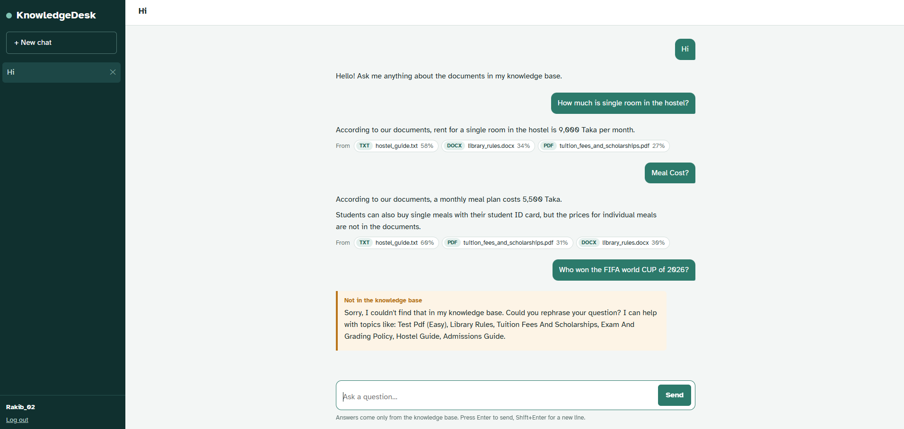
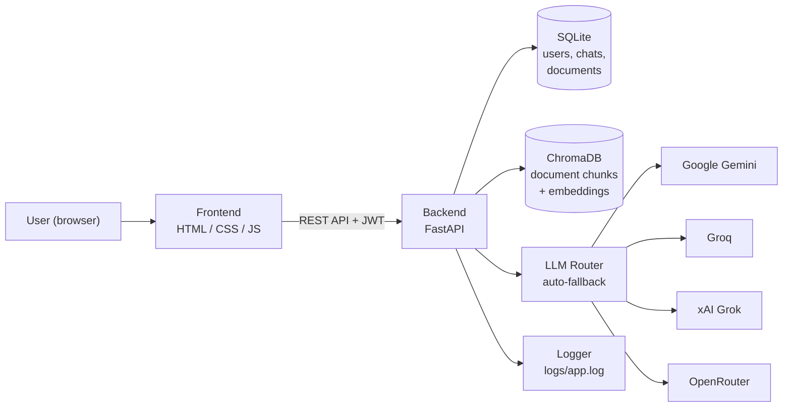
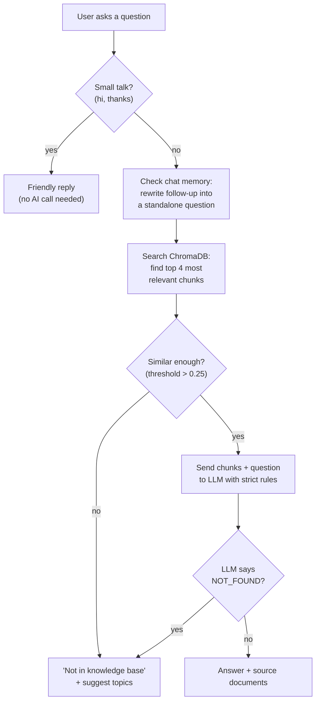
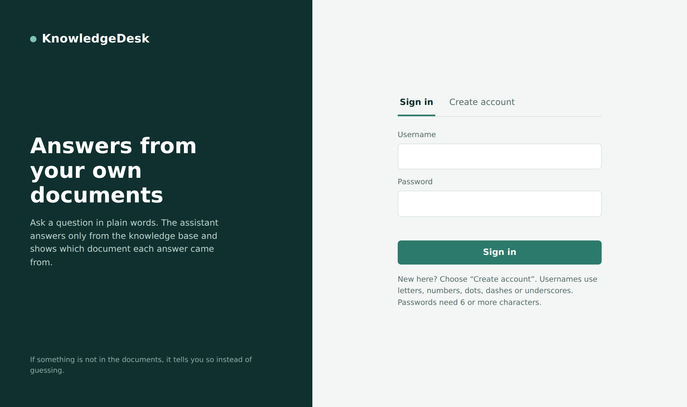
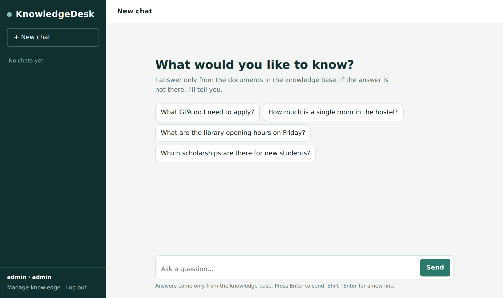
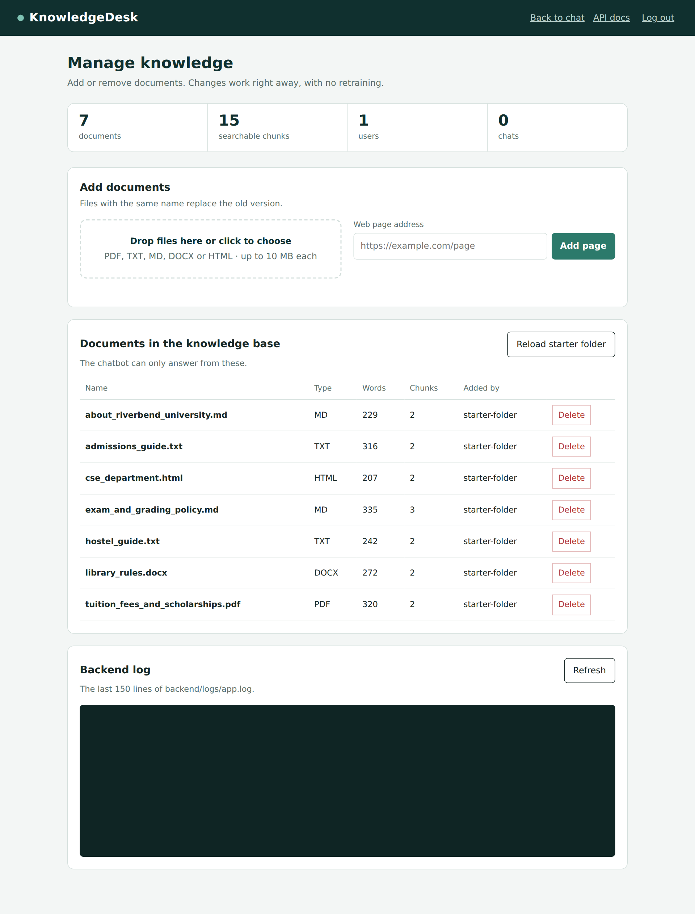
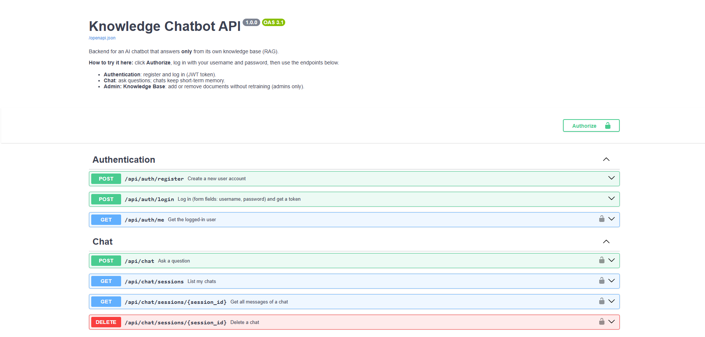

# KnowledgeDesk — AI Chatbot That Answers From Your Own Documents


**Rakib Hasan** |

[Live Demo](https://ai-knowledge-chatbot-n8vz.onrender.com/) | [API Docs](https://ai-knowledge-chatbot-n8vz.onrender.com/docs)

---

KnowledgeDesk is a full-stack **Retrieval-Augmented Generation (RAG)** chatbot. Upload your documents (PDF, Word, text, HTML, or web URLs), and the chatbot answers questions using **only** the information inside them. It never makes things up. If the answer isn't in the documents, it says so honestly and suggests topics it can help with.

<p align="center"></p>

---

## What It Does

- Users ask questions in plain language and get accurate, sourced answers
- Every answer shows which document it came from so users can verify
- The bot remembers the last 6 messages per chat, so follow-ups like "and the fees?" work naturally
- Admins can upload, replace, or delete documents at any time without restarting the server
- 11 AI models across 4 providers ensure the chatbot is always available, even when individual APIs go down
- All activity is logged and viewable from the admin panel
- Full REST API with auto-generated interactive docs at `/docs` and `/redoc`

---

## System Architecture



- **Frontend** communicates with the backend only through REST API calls with JWT tokens
- **ChromaDB** stores document chunks as vector embeddings and finds the most relevant ones when a user asks a question
- **LLM Router** tries AI models one by one (10 seconds max each) and stops at the first one that responds
- **SQLite** stores users, chats, messages, and document metadata with zero configuration
- **Logger** records every request, AI call, and error with timestamps

---

## How a Question Is Answered



There are two safety nets against hallucination:
- **Similarity threshold** checks if any document chunk is relevant before the AI even sees the question
- **NOT_FOUND rule** instructs the AI to explicitly say when the answer isn't in the provided context

---

## User Roles

**Admin** can:
- Upload documents (PDF, DOCX, TXT, MD, HTML, or web URLs)
- Delete documents from the knowledge base (takes effect instantly)
- View all indexed documents
- View backend activity logs from the admin panel
- Use the chat like a regular user

**Regular User** can:
- Register an account and log in
- Ask questions and get sourced answers
- View and continue past conversations
- Cannot access the admin panel or manage documents

---

## Multi-Provider LLM Fallback

The system does not depend on a single AI provider. It tries up to 11 models across 4 providers in order. If a model is busy, slow, or down, it moves to the next one automatically.

| Provider | Models | Cost |
| --- | --- | --- |
| Google Gemini | Gemini Flash Latest, Gemini 2.5 Flash Preview | Free tier |
| Groq | Llama 3.3 70B, Llama 3.1 8B, GPT-OSS 20B | Free version|
| xAI Grok | Grok 3 Mini Fast | Free tier |
| OpenRouter | Gemma 4 27B/31B, Nemotron Lightning/Super, Qwen 3.8 27B | Free Version|

You need at least one API key. The more you add, the more backup models you have.

---

## Screenshots

**Login and Registration**
<p align="center"></p>

**Chat with sourced answers and polite fallback for out-of-scope questions**
<p align="center"></p>

**New chat with suggested starter questions**
<p align="center"></p>

**Admin panel for managing the knowledge base**
<p align="center"></p>

**Auto-generated API documentation (Swagger)**
<p align="center"></p>

---

## Sample Knowledge Base

The `knowledge_base/` folder includes documents for a fictional university ("Riverbend University"). Using a fictional university proves the bot answers only from documents, not from outside knowledge.

| File | Topic |
| --- | --- |
| `about_riverbend_university.md` | History, campus, departments |
| `admissions_guide.txt` | Requirements, test scores, deadlines |
| `tuition_fees_and_scholarships.pdf` | Fees, payment plans, scholarships |
| `library_rules.docx` | Hours, borrowing limits, fines |
| `hostel_guide.txt` | Room types, rent, rules |
| `exam_and_grading_policy.md` | Marks, grades, retake policy |
| `cse_department.html` | CSE programs, labs, clubs |

---

## Quick Start

**Prerequisites:** Python 3.10+ and at least one free API key from [ai.google.dev](https://ai.google.dev), [console.groq.com](https://console.groq.com), or [openrouter.ai](https://openrouter.ai)

```bash
git clone https://github.com/rakib-506/ai-knowledge-chatbot.git
cd ai-knowledge-chatbot/backend

python -m venv venv
source venv/bin/activate        # Mac/Linux
# venv\Scripts\activate         # Windows

pip install -r requirements.txt

cp .env.example .env            # then add your API key(s) inside .env

uvicorn app.main:app --reload
```

Open http://127.0.0.1:8000 for the chat, http://127.0.0.1:8000/docs for API docs.
Default admin login: `admin` / `admin123`.

> First start downloads an embedding model (~80 MB) and indexes sample documents. Takes about a minute.

---

## Tech Stack

| Layer | Technology |
| --- | --- |
| Backend | FastAPI |
| Vector database | ChromaDB |
| Embeddings | all-MiniLM-L6-v2 (runs locally, no API needed) |
| LLM | Multi-provider fallback (Gemini, Groq, Grok, OpenRouter) |
| Database | SQLite |
| Auth | JWT + PBKDF2 password hashing |
| Frontend | HTML, CSS, JavaScript (vanilla) |
| Deployment | Render.com |

---

## Project Structure

```
ai-knowledge-chatbot/
├── backend/
│   ├── app/
│   │   ├── main.py             # FastAPI app, startup, request logging
│   │   ├── config.py           # Settings from .env
│   │   ├── auth.py             # Password hashing, JWT, admin check
│   │   ├── database.py         # SQLite: users, chats, documents
│   │   ├── loaders.py          # PDF / DOCX / TXT / MD / HTML / URL readers
│   │   ├── knowledge_base.py   # Chunking + ChromaDB operations
│   │   ├── chat.py             # RAG pipeline: memory, search, generate
│   │   ├── llm.py              # Multi-provider LLM router with fallback
│   │   ├── logger.py           # Console + file logging
│   │   ├── schemas.py          # Request/response models
│   │   └── routers/            # API endpoints (auth, chat, knowledge)
│   ├── requirements.txt
│   └── .env.example
├── frontend/
│   ├── index.html              # Login / register
│   ├── chat.html               # Chat interface
│   ├── admin.html              # Knowledge base manager + logs
│   ├── css/style.css
│   └── js/                     # api.js, login.js, chat.js, admin.js
├── knowledge_base/             # Sample documents
├── docs/API.md                 # API reference
└── render.yaml                 # Render deployment config
```

---

## Limitations and Future Work

- Free-tier APIs have rate limits; the multi-provider fallback mitigates this
- Memory is per-chat, not across different conversations
- Planned: streaming answers, chat export, Docker setup, evaluation framework
